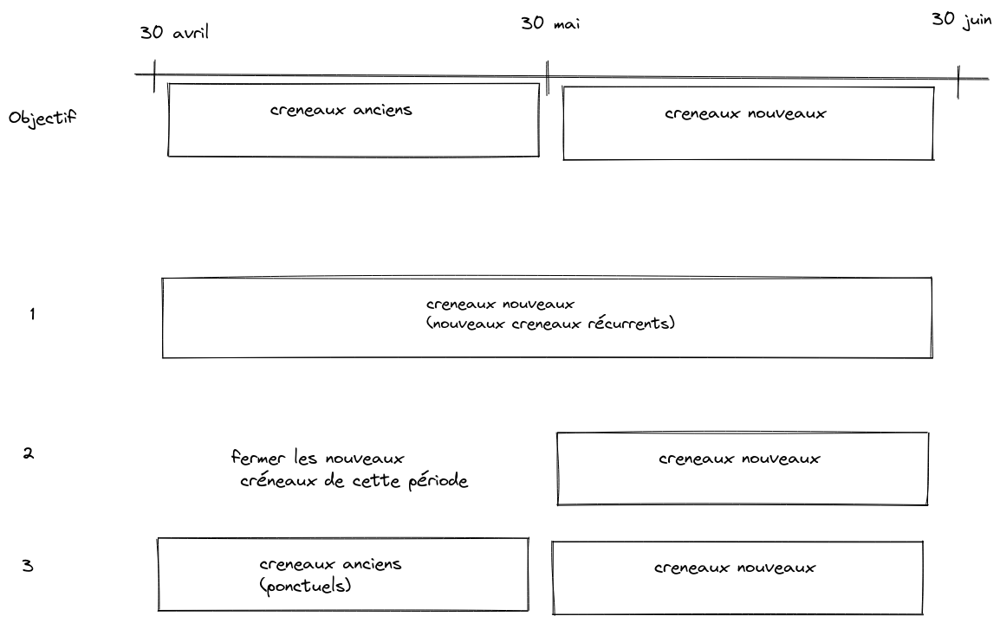

# Manipulation de créneaux : changement de créneaux récurrents à partir d'un instant T

Shéma du process



## Préalables

déterminer l'agenda

```
agenda = Agenda.find(46)
apt_type = AppointmentType.find(3)

days_first_period = [
  { date: '03/05/2022' },
  { date: '10/05/2022' },
  { date: '17/05/2022' },
  { date: '24/05/2022' },
  { date: '31/05/2022' }
]
```

## 1. Fermer les créneaux anciens sur toute la période

```
days_first_period.each do |day|
  Slot.where(
    agenda_id: agenda.id,
    appointment_type_id: appointment_type.id,
    date: day[:date],
  ).update_all(available: false)
end
```

## 2. Ajouter les nouveaux créneaux récurrents

```
slot_type = SlotType.find(14331)
```

-> dans l'interface

découper slot_factory.rb pour créer seulement les bons créneaux

copier ça en console :

```
def slot_exists(date, slot_type)
  Slot.exists? date: date, slot_type: slot_type, starting_time: slot_type.starting_time
end

def date_invalid?(date)
  date.blank? || date.saturday? || date.sunday? || Holidays.on(date, :fr).any?
end

def create_slot(date, slot_type)
  return unless date && slot_type

  return if slot_exists(date, slot_type) || date_invalid?(date)

  Slot.create(
    date: date, agenda: slot_type.agenda, slot_type: slot_type,
    appointment_type: slot_type.appointment_type, starting_time: slot_type.starting_time,
    duration: slot_type.duration, capacity: slot_type.capacity, available: true
  )
end

def open_dates_on(weekday)
  open_dates.select { |date| date.strftime('%A').downcase == weekday }
end

def open_dates
  @open_dates ||= (@start_date..@end_date).to_a - Holidays.between(@start_date, @end_date, :fr).map { |h| h[:date] }
end
```

puis :

```
slot_types = SlotType.where(
  agenda_id: agenda.id,
  appointment_type_id: appointment_type.id,
)

slot_types.each do |slot_type|
  open_dates_on(slot_type.week_day).each do |date|
    create_slot date, slot_type
  end
end
```

## 3. Fermer les nouveaux créneaux sur la premiere période

```
days_first_period.each do |day|
  Slot.where(
    agenda_id: agenda.id,
    appointment_type_id: appointment_type.id,
    slot_type_id: slot_type.id,
    date: day[:date],
  ).update_all(available: false)
end
```

## 4. créer des créneaux ponctuels (anciens) sur la première période

```
Slot.create(
  agenda_id: agenda.id,
  appointment_type_id: appointment_type.id,
)

Slot.create(
  date: '24/05/2022',
  agenda: agenda,
  appointment_type: apt_type,
  starting_time: Time.new(2021, 6, 21, 14, 30, 0),
  duration: 60,
  capacity: 10,
  available: true
)

Slot.create(
  date: '31/05/2022',
  agenda: agenda,
  appointment_type: apt_type,
  starting_time: Time.new(2021, 6, 21, 14, 30, 0),
  duration: 60,
  capacity: 10,
  available: true
)
```
